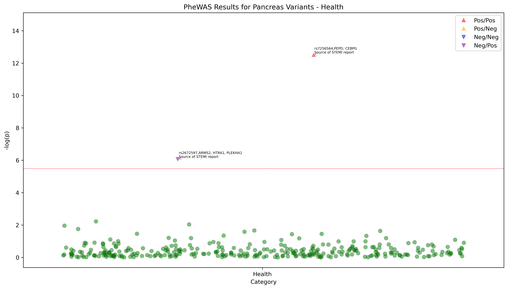
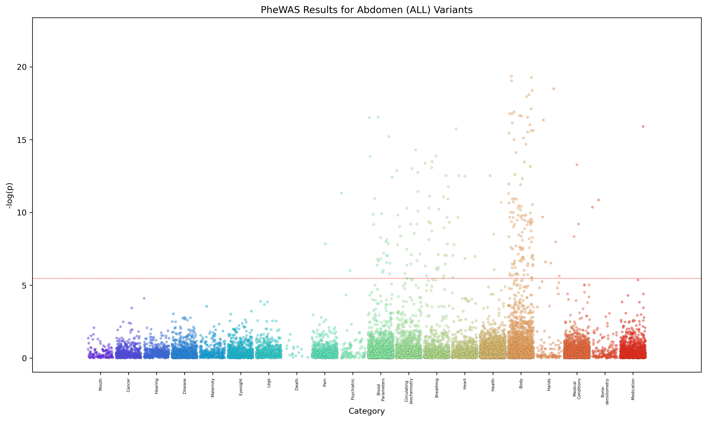
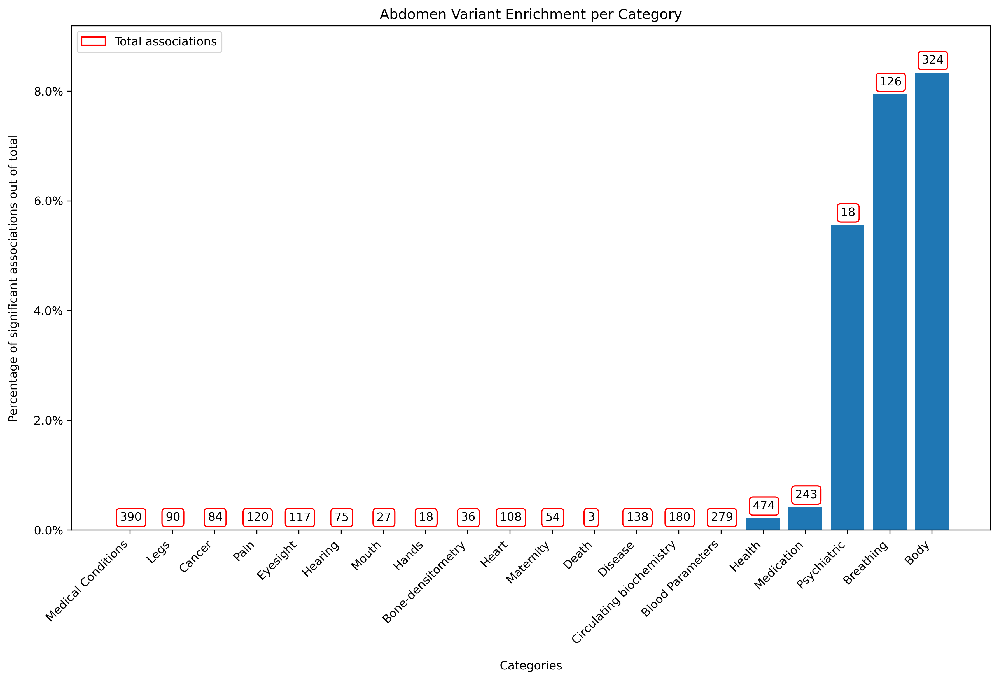

# PYPE: Python pipeline for PheWAS 
A Python Package for PheWAS Execution, Visualization, and Analysis

## Features
PYPE is a command line tool that can be used to run Phenome Wide Association Studies (PheWAS) on data produced by the UK Biobank (Version 1.0). 

Currently, PYPE takes as input BED/BIM/FAM files for the genotype data (only if running PheWAS with a set of variants), and TAB files for the phenotype data and outputs a set of TSV files for each chromosome (if using genotype data) or phenotype (if only using phenotype data) with the results of the PheWAS analysis (including p-values, beta values, and standard error). The user can then run the visualization scripts to generate manhattan plots across all categories / individual categories of phenotypes with annotations:

<p align="center">
  
</p>

without annotations:

<p align="center">
  
</p>

volcano plots for each genetic variant tested:

<p align="center">
  
</p>

and variant enrichment plots that show the number of significant variant-phenotype associations per phenotype category:  
<p align="center">
  
</p>

PYPE also annotates each significant variant with the upstream and downstream genes close to the variant, providing output files that give descriptions of the variants' functional consequences, the genes' role in biological processes, as well as a variety of other annotations that the user can request. It does this using the lightweight REST API from the [BioThings API](https://biothings.io/). Lastly, using a port of the TwoSampleMR code from [MRC Integrative Epidemiology Unit at the University of Bristol](https://github.com/MRCIEU/TwoSampleMR), PYPE can be used to run Mendelian Randomization (MR) analysis on the variants from the PheWAS analysis to help researchers investigate the causal relationships between genetic variants and phenotypes.

## Installation

PYPE is currently a command line tool and can be installed by cloning the repository and running the setup.py file. 

## Usage

PYPE is a command line tool, so the best way of using it is to create a simple bash script where you can specify all the parameters that you want to use.

Here we will use the example data provided with PYPE to run a PheWAS analysis on fake UK Biobank phenotype and genotype data 

```
#!/bin/bash

pype \
  --phenotypes ~/test_data/input_ex/test.tab \
  --bfiles ~/test_data/input_ex/test_bfiles \
  --covariates ~/test_data/input_ex/test_covariates.tsv \
  --samples ~/test_data/input_ex/test_in_sample_IDs.txt \
  --variants ~/test_data/input_ex/test_Top_SNPS.tsv \
  --threads 1 \
  --memory 16000 \
  --location ~/test_data/output_ex/ \
  --name test_phewas \


```

## Citation

TBD

## Future Plans

Support for PheWAS on data from a greater variety of studies, faster PheWAS execution, and more visualization options.

Move from annotating nearby genes using manual method to using the BioThings API.

## License
This project is licensed under the Apache 2.0 license.

## Author
Taykhoom Dalal

## Mentor
[Dr. Chirag Patel (Harvard Medical School)](https://dbmi.hms.harvard.edu/people/chirag-patel)
