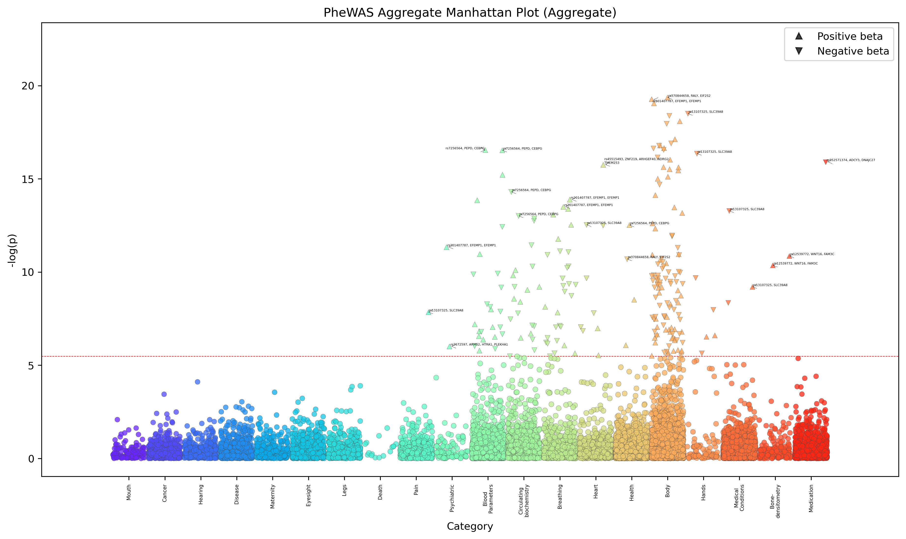
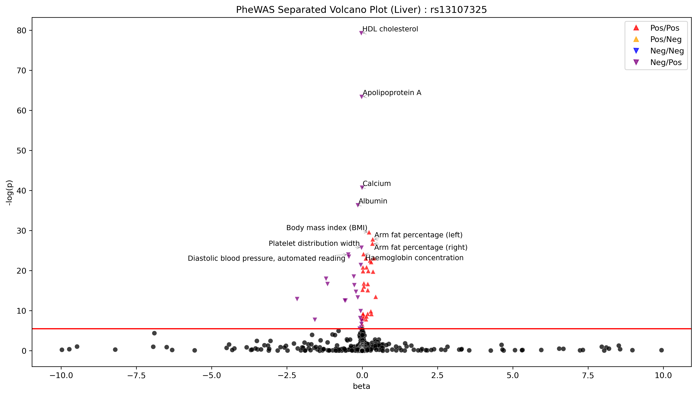
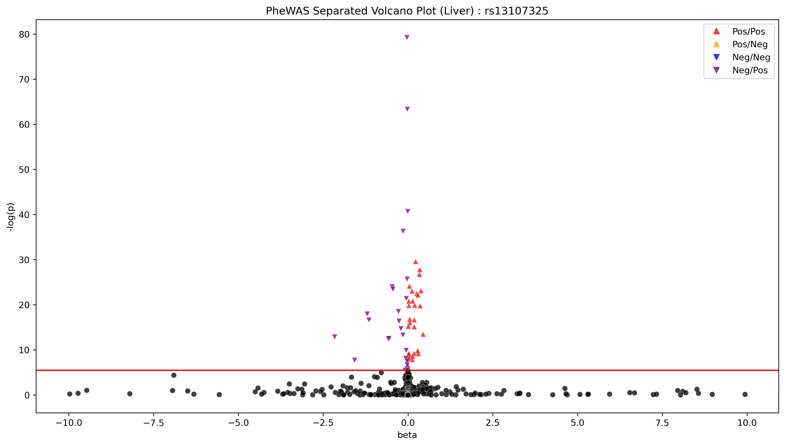
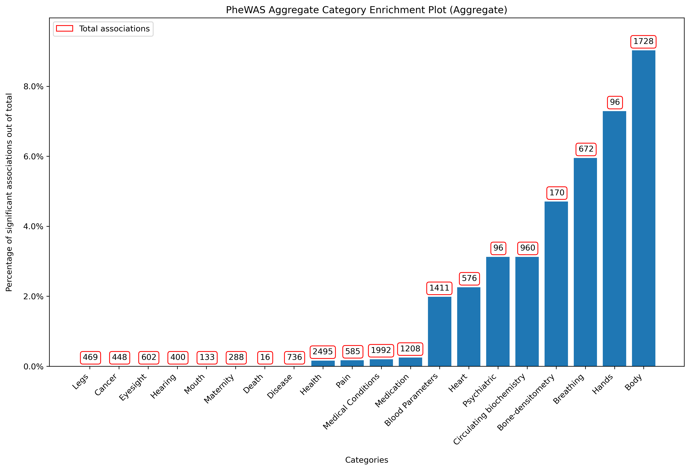
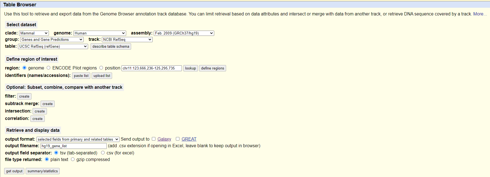
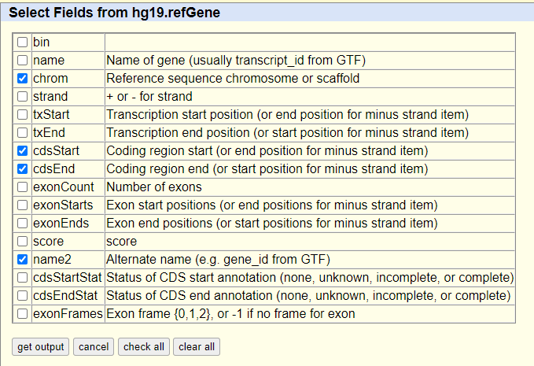

# PYPE: Python pipeline for PheWAS 
A Python Package for PheWAS Execution, Visualization, and Analysis

## Features
PYPE is a command line tool that can be used to run Phenome Wide Association Studies (PheWAS) on data produced by the UK Biobank or other Biobank sources (provided they follow similar format to the UKBB). 

Currently, PYPE takes as input BED/BIM/FAM files for the genotype data (only if running PheWAS with a set of variants), and TAB files (TSV) for the phenotype data and outputs a set of TSV files for each chromosome (if using genotype data) or phenotype (if only using phenotype data) with the results of the PheWAS analysis (including p-values, beta values, and standard error). The user can then run the visualization scripts to generate manhattan plots across all categories with annotations:

<p align="center">
	
</p>

without annotations:

<p align="center">
	
</p>

individual categories of phenotypes with annotations:

<p align="center">
	
</p>

without annotations:

<p align="center">
	
</p>

volcano plots for each genetic variant tested with annotations:

<p align="center">
	
</p>

without annotations:

<p align="center">
	
</p>

and variant enrichment plots that show the number of significant variant-phenotype associations per phenotype category:  
<p align="center">
	
</p>

PYPE also annotates each significant variant with the upstream and downstream genes close to the variant, providing output files that give basic descriptions of the variants' functional consequences, the genes' role in biological processes, as well as a variety of other annotations that the user can request. It does this using the lightweight REST API from the [BioThings API](https://biothings.io/). Lastly, using a port of the MR functionality from TwoSampleMR code from the [MRC Integrative Epidemiology Unit at the University of Bristol](https://github.com/MRCIEU/TwoSampleMR) and from the [Do Laboratory at Mount Sinai](https://github.com/rondolab/MR-PRESSO), PYPE can be used to run Mendelian Randomization (MR) analysis on the variants from the PheWAS analysis to help researchers investigate the causal relationships between genetic variants and phenotypes.

## Installation

PYPE is currently a command line tool and can be installed by cloning the repository and installing the necessary packages using the [environment.yml](environment.yml) file. It is also extremely important to note that PYPE requires the installation of plink2, which can be found [here](https://www.cog-genomics.org/plink/2.0/), on either the user's local machine or on their High Performance Cluster (preferred), as a program on the PATH environment variable or accessible through some sort of environment [modules](https://modules.readthedocs.io/en/latest/).

To install Plink2:
1. go to the [Plink2 downloads page](https://www.cog-genomics.org/plink/2.0/)
2. Click download on the relevant binary build (i.e. https://s3.amazonaws.com/plink2-assets/plink2_mac_arm64_20240318.zip for MacOS)
3. Unzip the file
4. Add the binary to your path or make it globally accessible by manually moving it (i.e. for your personal MacOS machine: sudo cp plink2 /usr/local/bin)
5. Make the binary executable (i.e. sudo chmod 755 /usr/local/bin/plink2)
6. Run `plink2 --version` in the terminal. You should see output specifying the Plink2 version and usage (i.e. PLINK v2.00a6 M1 (18 Mar 2024))

To install PYPE
1. Make sure you have conda installed on your system
2. Run the following command in your terminal `conda env create -f environment.yml`

This will create a conda environment called PYPE containing all of the necessary packages used to run the various pipeline stages.

## Usage

PYPE is a command line tool, so the best way of using it is to create a simple bash script where you can specify all the parameters that you want to use.

To see minimal reproducible examples of how to use PYPE, please see the [UKBB example scripts](example/UKBB/example_scripts) folder or the [external data sources example scripts](example/Non_UKBB/example_scripts/) folder. Please note that you can also specify the "-h" argument for any of the parts of the pipeline in order to get more detailed information about the arguments. Additionally, if anything is unclear, please raise an issue and I will get to it as soon as possible.

## UKBB

### UKBB PheWAS

Here we will use the example data provided with PYPE to run a PheWAS analysis on fake UK Biobank phenotype and genotype data using [category 1006 - Physical measure summary](https://biobank.ndph.ox.ac.uk/showcase/label.cgi?id=1006), [category 1019 - Linked Health Outcomes](https://biobank.ndph.ox.ac.uk/showcase/label.cgi?id=1019), and [category 17518 - Blood biochemistry](https://biobank.ndph.ox.ac.uk/showcase/label.cgi?id=17518) as the phenotype categories of interest. All of the PheWAS scripts are run using the run_phewas.py file. The [phenotype data](example/UKBB/example_data/phenotype_files/example.tab) follows the format of a real UKBB phenotype file, but has been mixed up and reduced in size to allow for easier packaging in this repository. It is essential that the ID column is the first column, and that the IDs correspond to the same individuals in the BED/BIM/FAM files if you are running a genotype PheWAS.

[geno_phewas.sh](example/UKBB/example_scripts/geno_phewas.sh) 1006

[geno_phewas.sh](example/UKBB/example_scripts/geno_phewas.sh) 1019

[geno_phewas.sh](example/UKBB/example_scripts/geno_phewas.sh) 17518

You can also run PheWAS analysis with phenotypes as your independent variables, specifically using phenotypes [90012](https://biobank.ndph.ox.ac.uk/ukb/field.cgi?id=90012) (Overall Acceleration Average) and [21001](https://biobank.ctsu.ox.ac.uk/crystal/field.cgi?id=21001) (Body Mass Index). We run it for the same three categories of phenotype as before as the phenotypes of interest. 

[pheno_phewas.sh](example/UKBB/example_scripts/pheno_phewas.sh) 1006

[pheno_phewas.sh](example/UKBB/example_scripts/pheno_phewas.sh) 1019

[pheno_phewas.sh](example/UKBB/example_scripts/pheno_phewas.sh) 17518

After running these scripts, we have generated 6 new folders [genotype_pheWAS_1006](example/UKBB/example_output/), [genotype_pheWAS_1019](example/UKBB/example_output/), [genotype_pheWAS_17518](example/UKBB/example_output/), [phenotype_pheWAS_1006](example/UKBB/example_output/), [phenotype_pheWAS_1019](example/UKBB/example_output/), [phenotype_pheWAS_17518](example/UKBB/example_output/).

### UKBB Visualization

After running the PheWAS analysis, we need to use the [annotate_ukbb_categories.py](pype/annotate_ukbb_categories.py) file to annotate the results with the category names. This code will help create the file that can be used to create the various visualizations and is especially useful if you used the same independent variables across multiple analyses, as it will aggregate the results into one file that can be used for visualization. See the [example annotated category file](example/UKBB/example_output/genotype_pheWAS_categories_aggregated.tsv) for an example of what the output looks like.

[annotate_categories.sh](example/UKBB/example_scripts/annotate_categories.sh)

By running the script below, we can generate manhattan plots, volcano plots, and category enrichment plots for the PheWAS analysis that we ran above, as it calls the visualize.py file. 

[visualize.sh](example/UKBB/example_scripts/visualize.sh)

### Mendelian Randomization

By running the script below, we can also run an MR analysis using a separate set of variants (not from the example data above as you need at least 3 variants to run MR (for most MR tests)). This script uses the run_mr.py file to do so. Ideally, the exposure variants would be the same variants used in the PheWAS analysis and the outcome variants would be another set of variants associated with a particular phenotype of interest. This phenotype of interest should be one of the phenotypes found as significantly associated with one or more of the variants used in the PheWAS.

[run_mr.sh](example/UKBB/example_scripts/run_mr.sh)

## Non_UKBB

### Non_UKBB PheWAS

The process for running a PheWAS for non-UKBB data is very similar, but with some slight modifications. Since the UKBB is very standardized, it is easy to do things like query for phenotype descriptions and categories, or grab phenotypes that are specifically associated with a health category, but with an external data source, it is not as clear cut. However, you can still do almost all of the same analyses on non-UKBB data using PYPE, but it will require some adaptation for your data.

For the following examples, we will utilize our own custom phenotype file which was generated using the following [script](example/Non_UKBB/example_data/convert_UKBB_to_general.py). Essentially, I took the phenotype file from the UKBB example, converted the columns data fields into strings which represent the phenotype. For example, the file now looks like the following:

```
ID		Weight method	Sex	Year of birth	Hand grip strength (left)
9949691	1.0				1	1964			48.0
1856689	1.0				1	1955			12.0
1558378	1.0				0	1939			40.0
1610702	1.0				0	1950			24.0
```

It is essential that the ID column is the first column, and that the IDs correspond to the same individuals in the BED/BIM/FAM files if you are running a genotype PheWAS. (The genotype data information is the same as for the UKBB, and is described in the following File format section.)

One major difference from the UKBB PheWAS is that you cannot specify a category of phenotypes like we did for the UKBB data using categories 1006, 1019, etc. Instead, you must specify a set of dependent phenotypes used in your PheWAS. For an example, see the [example_dependent_phenotypes.txt](example/Non_UKBB/example_data/phenotype_files/example_dependent_phenotypes.txt) file. It basically contains a list of all of the phenotypes you want to regress against your variants (Y ~ X + COV where Y = dependent phenptypes, X = variants (or even other phenotypes), COV = covariate phenotypes). You can either specify these variants used the --dependent_phenotypes_file argument or the --dependent_phenotypes_list argument in run_phewas.py.

For running PheWAS using non-UKBB data, this is the main consideration. For an example on exactly how to do this, please see the provided example [genotype PheWAS](example/Non_UKBB/example_scripts/geno_phewas.sh) or [phenotype PheWAS](example/Non_UKBB/example_scripts/pheno_phewas.sh) scripts. 

### Non_UKBB Visualization

After running the PheWAS analysis, we need to use the [annotate_external_categories.py](pype/annotate_external_categories.py) file to annotate the results with the category names. This code will help create the file that can be used to create the various visualizations. The difference between this code and that used for the UKBB is that we cannot directly query a URL for information about which category a phenotype belongs to. Instead, we have to specify a custom mapping from phenotype ==> category ourselves. As an example, we have included a [custom mapping file](example/Non_UKBB/example_data/phenotype_files/example_mapper.tsv) in the Non_UKBB example data folder. This file must be a tab separated file with the first column being the phenotype name and the second column being the category to map that phenotype to. 

[annotate_categories.sh](example/Non_UKBB/example_scripts/annotate_categories.sh)

Given the output file this creates, the visualization script is identical to the UKBB version and will produce the same output files.

## File Formats

### PheWAS file formats

--aggregate_phenotype_file /path/to/aggregate/phenotype/file

This file should have individuals on the rows (listing individual IDs under the 'f.eid' column if UKBB) and phenotypes on the columns. The individual IDs should also be the **first** column in the phenotype file. This data should come directly from your biobank or data repository of choice. Row one should contain the column names (as the header). Please note that the IDs in this file **MUST** correspond to the same IDs in the BED/BIM/FAM files if you are running a genotype PheWAS. The number of samples can be more or less than in that file, but they must be able to be merged on the ID column.

--bfiles_directory /path/to/bfiles/directory

This is the directory where the BIM/BED/FAM files are located. For more information on this data type, please see the [plink documentation](https://www.cog-genomics.org/plink/2.0/formats#bed)This data should come directly from the biobank data source. If the data is not in this format (for example BGEN), it can be converted using the plink2 command line tool using the follow script for each bgen file for each chromosome:

```bash
plink2 --bgen /path/to/ukb_chr$1.bgen ref-last \
			--sample /path/to/ukb_chr$1.sample \
			--threads THREADS \
			--memory MEMORY \
			--make-bed \
			--out /path/to/output/with/prefix/chr$1
```

--covariates_file /path/to/covariates/file

This file contain a header row with column one holding the data for the phenotypes used as covariates. This column should contain fields from the [UKBB Data Showcase](https://biobank.ndph.ox.ac.uk/showcase/search.cgi) if using UKBB data. Regardless of data source, however, the phenotypes listed in this file *MUST* be contained in the aggregate_phenotype_file. This file is used as covariates for the PheWAS analysis. Listed below are some common covariates that can be used for UKBB data in particular (we have also listed the descriptions alongside for clarity).

```
Field	Description
31		Sex
34		Year of Birth
52		Month of Birth
53		Date of attending assessment center
54		Assessment Center
21000	Ethnic background 
22001	Genetic Sex 
22009	Genetic Principal Components
```

--sample_file /path/to/sample/file

This file should contain the sample IDs of individuals that you want to include or exclude from the PheWAS analysis. Currently, this file is required even if you want to keep all the individuals (just create another file with all of the sample IDs listed in it). This file should have no header row and should be a list of individual IDs that match the individual IDs in the phenotype file (and the genotype files if being used). For example:

```	
3816366
5752377
2272489
1983956
1646136
2343348
4934200
5778231
```

--variant_file /path/to/variant/file

This file should contain the genetic variants that you want to use as the independent variables in your analysis. This file should be tab separated with a header row with the following columns: rsID, CHR, POS, Non_Effect, Effect, BETA, SE, P. Here is an example of what the file should look like (Effect ==> Effect Allele and Non_Effect ==> Non Effect Allele):

```
rsID		CHR	POS			Non_Effect	Effect	BETA		SE			P
rs2042995	2	179558366	C			T		0.172193	0.0242183	1.2e-12
rs56078722	3	124420735	T			C		-0.161154	0.0279223	7.9e-09
rs572118015	3	196527497	C			T		2.21501		0.355689	4.7e-10
rs1892252	6	25772639	C			G		0.15306		0.0277552	3.5e-08
rs149897	6	28006650	G			A		-0.123681	0.022055	2e-08
rs111846618	7	73554836	C			T		-0.216041	0.0370781	5.7e-09
rs55963900	7	120977734	A			G		-0.13178	0.022519	4.9e-09
rs76871782	7	145200948	G			A		8.73297		1.47709		3.4e-09
rs1991860	8	75737818	T			C		-0.16939	0.0206412	2.3e-16
rs2202		10	30168699	T			C		-0.129675	0.0217878	2.7e-09
rs183837045	19	41024118	T			C		-0.554014	0.0942024	4.1e-09

```

--independent_phenotypes_file /path/to/phenotypes/file

This file is used when running a PheWAS with phenotypes as both the independent variables and as the dependent variables. This file should have no header row and should be a list of phenotype data fields from the UK Biobank Data Showcase if using UKBB data or the phenotype names if using any other data. For example:

```
90012
90013
21001
```

or

```
Overall acceleration average
Body mass index (BMI)
```

*Note that the argument --phenotypes_list can also be specified, where the same information is provided in a space separated list. For example:

```
--independent_phenotypes_list 90012 90013 21001
```

or

```
--independent_phenotypes_list "Overall acceleration average" "Body mass index (BMI)"
```

### Visualization 

--phewas_results /path/to/phewas/results

This file should be the output of the annotate_categories.py file. This file should be tab separated with a header row with the following columns (there are some optional columns in here depending on the PheWAS analysis run): PheWAS_Category, Ethnicity (optional), Description (optional), Data_Field, Independent_Var, Samples, -log(p), p-val, beta, std_err, Category, Gene (optional). See the [UKBB example](example/Non_UKBB/example_output/genotype_pheWAS_categories_aggregated.tsv) or [External data source example](example/Non_UKBB/example_output/genotype_pheWAS_categories_aggregated.tsv) files for reference.

--mapping /path/to/mapping/file

This is an optional tab separated file *which is only used for the UKBB* which contains a custom user mapping from the categories for each phenotype grabbed from the UK Biobank Data Showcase to a custom category. This file should have a header row with the following columns: Old_categories,	New_categories. An example of what the file should look like is shown below (note that the old categories in this example might have more than one word, but overall there are only two columns of values) and can also be seen at [category_mappings.txt](pype/cached/category_mappings.txt)

```
Old_categories				New_categories
Summary Maternity			Maternity
Stroke outcomes				Medical Conditions
Death register				Death
Infectious Disease Antigens	Disease
Blood biochemistry			Circulating biochemistry
Blood count	Blood 			Parameters
```

--variant_files /path/to/variant/file

These files should be the ones used in the PheWAS analysis and thus have the same format.

--gene_file /path/to/gene/file

This file should be a tab separated file (from the UCSC genome browser) with a header row with the following columns: #chrom, cdsStart, cdsEnd, name2. An example of what the file should look like is shown below, and can also be seen at [hg19_gene_list](pype/cached/hg19_gene_list):

```
#chrom	cdsStart	cdsEnd		name2
chr1	67000041	67208778	SGIP1
chr1	67000041	67208778	SGIP1
chr1	67000041	67208778	SGIP1
```

### Mendelian Randomization

--exposure_variants / --outcome_variants 

These files should be the ones used in the PheWAS and thus have the same format.

Currently this package supports the following MR tests:
1. Inverse Variance Weighted (IVW)
2. MR-Egger
3. Simple Median
4. Weighted Median
5. Penalized Weighted Median
6. Simple Mode
7. Simple Mode with NO Measurement Error (NOME) assumption
8. Weighted Mode
9. Penalized Mode
10. Weighted Mode with NOME assumption
11. MR-PRESSO

## Download HG19 Gene List

Go to [UCSD Genome Browser Table Browser](https://genome.ucsc.edu/cgi-bin/hgTables) and select the following parameters:

Dataset
* clade: Mammal
* genome: Human
* assembly: Feb. 2009 (GRCh37/hg19)
* group: Genes and Gene Predictions
* track: NCBI RefSeq Genes
* table: UCSC RefSeq (refGene)

Define region of interest
* region: genome

Retrieve and display data
* output format: selected fields from primary and related tables
* output file name: hg19_gene_list.txt
* output file format: tab-separated values

<p align="center">
	
</p>

Then click on get output and select the following fields from hg19.refGene:
* chrom
* cdsStart
* cdsEnd
* name2

<p align="center">
	
</p>

Finally, click on get output, downloading the file, and then save this file to the cached folder under the pype directory.

## Citation

TBD

## Future Plans

1. Better support for PheWAS on data from a greater variety of studies, faster PheWAS execution, and more visualization options.
2. Move from annotating nearby genes using manual method using HG19 gene list to using the BioThings API.
3. Adding all known Mendelian Randomization methods.
4. More robust harmonization methods for Mendelian Randomization code.
5. More comprehensive documentation

## License
This project is licensed under the Apache 2.0 license.

## Author
Taykhoom Dalal (Ph.D. student at the [Tri-Institutional Ph.D. Program in Computational Biology and Medicine](https://compbio.triiprograms.org/))

## Mentor
[Dr. Chirag Patel (Harvard Medical School)](https://dbmi.hms.harvard.edu/people/chirag-patel)
